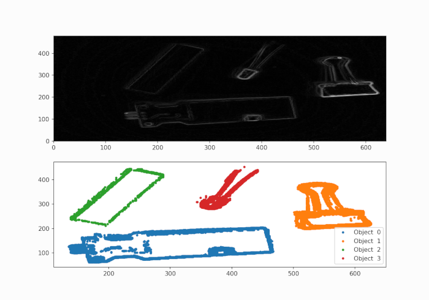

# image_processing
Full set of Python algorithms dedicated to object detection using the Raspberry Pi's Picamera, enabling real-time image processing capabilities.

**Produce the Following Plot with Object Boundaries Detected**
{ width="800" height="600" style="display: block; margin: 0 auto" }
