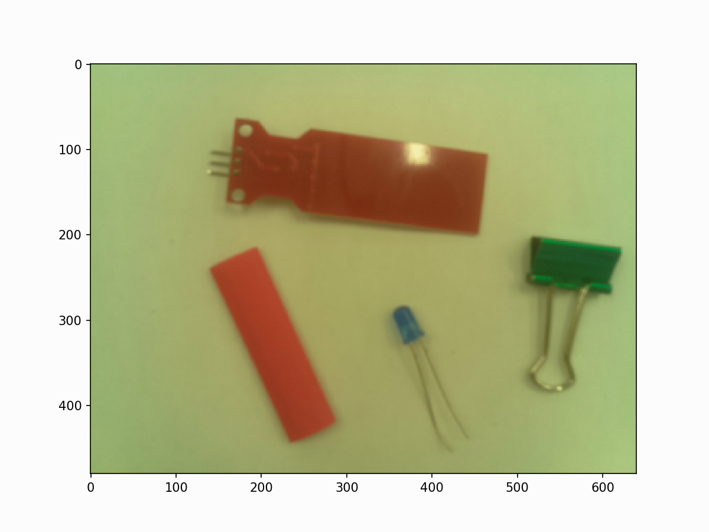

# Image Processing with Raspberry Pi and Python
Full set of Python algorithms dedicated to object detection using the Raspberry Pi's Picamera, enabling real-time image processing.

**Produce the Following Plot with Multiple Objects Detected**

**Original Image**

